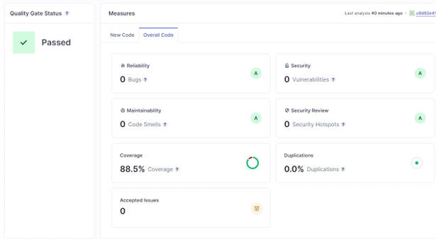

# 🎉 Event Planner System
An event planner system for managing and organizing events such as weddings, birthdays, and workshops.

## 🧰 Tech Stack
Java (Core Application Logic)

Command Line Interface (CLI-based User Interaction)

Cucumber (BDD - Behavior Driven Development)

JUnit (TDD - Test Driven Development)

SonarCloud (Code Quality & Coverage Analysis)

## Project Structure
```
src/
├── main/
│   └── java/com/example/
│       ├── data/
│       ├── entites/
│       ├── services/
│       ├── App.java
│       ├── Main.java
│       └── MainMenu.java
│   └── resources/
├── test/
│   ├── java/applicationTest/
│   └── resources/features/
```

## 🚀 Features
### 👤 User Management
Registration and login for:

- Admin

- Organizer (User)

- Service Provider (Vendor)

### 🗓 Event Creation & Management
- Create/edit/delete events with:

- Date, Time, Location, Theme

- Attendee count

- Images (file paths in CLI)

### 📍 Venue Management
- Venue availability check

- Add new venues with capacity, pricing

### 🤝 Service Provider Management\

- Search, filter, and book vendors


### 📆 Scheduling & Calendar
- Calendar view of all events

### 📬 Communication
Email messaging system (between users, vendors, and organizers)

## 🧪 Testing
Cucumber used to define user stories and behavior

JUnit for backend unit tests

Organized using BDD and TDD principles

## 📊 Code Quality
SonarCloud integrated to:

Analyze code smells

Measure coverage

Enforce clean code practices


